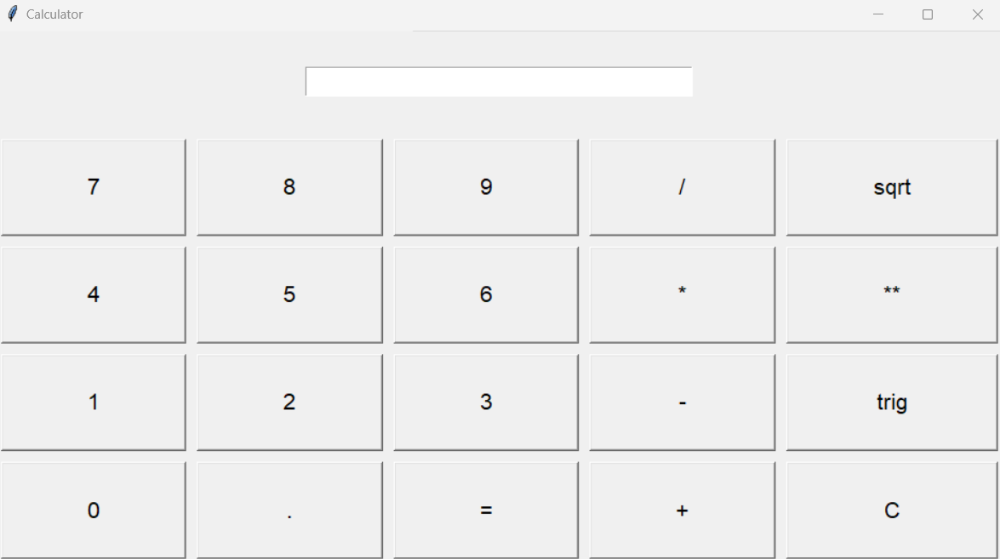

# Calculator App

This is a simple calculator application built using Python's Tkinter library. It provides basic arithmetic operations, square root calculation, and trigonometric calculations for sine, cosine, and tangent.

## Features

- Addition (+)
- Subtraction (-)
- Multiplication (*)
- Division (/)
- Square Root (√)
- Exponentiation (^)
- Trigonometric calculations (sine, cosine, tangent)
- Clear entry (C)

## Usage

1. Enter numerical values using the numeric keypad.
2. Use the arithmetic operator buttons to perform calculations.
3. Press the "=" button to evaluate the expression and display the result.
4. To calculate the square root of a number, enter the number and click the "√" button.
5. To perform exponentiation, enter the base, followed by the "^" button, and then the exponent.
6. To perform trigonometric calculations, enter the angle in degrees and click the "trig" button.
7. Press the "C" button to clear the entry field.

## Requirements

- Python 3.x
- Tkinter (usually included with Python)

## How to Run

1. Clone or download this repository to your local machine.
2. Open a terminal or command prompt.
3. Navigate to the directory where the `calculator_app.py` file is located.
4. Run the following command:
5. The calculator application window will appear.

## Screenshots

## Notes

- This calculator does not have parentheses for complex expressions.
- Use "^" for exponentiation, e.g., "2^3" for 2 raised to the power of 3.
- Trigonometric calculations provide the sine, cosine, and tangent values in radians.
- Square root can only be calculated for non-negative numbers.

## Author

- Chathura Abeygunawardhana

